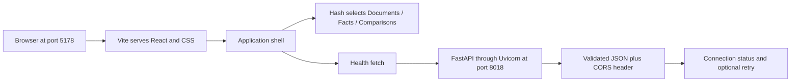

# User and data flow log

Updated after every completed phase. Current milestone: Part 1 complete (phases 1–5). Current local ports: frontend 5178, API 8018.

## Phase 1 — Project foundation
User flow: no website runs yet; the developer opens the frontend and backend folders.
Data flow: reference PDFs remain local files. There is no browser request, server, database, or document processing yet.

## Phase 2 — React homepage
User flow: open localhost:5173 and see the Fact Layer introduction.
Data flow: browser requests index.html and frontend modules from Vite; React mounts App into the root element. All displayed text is static. No API call or persistent data exists.

## Phase 3 — Health API
User flow: the homepage still shows static content. A developer can separately open localhost:8000/health or /docs.
Data flow: HTTP GET /health → Uvicorn → FastAPI route → Pydantic response serialization → JSON response. React is not connected yet. No data is stored.

## Phase 4 — Browser/API connection
User flow: open the homepage → see “Checking connection…” → “Backend connected” if healthy. If unavailable, see an offline state and a Retry connection button.
Data flow: React effect → browser fetch to VITE_API_BASE_URL/health (default http://127.0.0.1:8000) → FastAPI → JSON and CORS header → runtime shape check → React state update → status label rerenders. Requests abort after five seconds or component cleanup. Retry starts a new request. Status is a point-in-time check, not continuous monitoring. Nothing is persisted.

## Phase 5 — Current complete user and data flow
**User journey:** open http://127.0.0.1:5178 → Documents screen → connection indicator checks the API. Navigate using sidebar links on desktop or top links on mobile, or select a summary card. Facts and Comparisons display their own headings and empty states. Browser Back and refresh retain the selected hash route. Upload is visibly disabled and upcoming. There are no documents to open or results to inspect yet.

**Page flow:** browser → Vite on 5178 → HTML, React modules and compiled CSS → React mounts the shell. The URL hash (#documents, #facts, #comparisons) selects local view state. Clicking a link updates the hash; a hashchange listener updates the visible section and title. No API request is needed to switch sections. The skip link targets the main content landmark. Unknown hashes fall back to Documents.

**API flow:** BackendStatus mounts → fetch http://127.0.0.1:8018/health → Uvicorn → FastAPI health handler → Pydantic JSON serialization → CORS permits localhost/127.0.0.1:5178 → browser validates the response shape → component updates its checking/connected/offline state. Failure or five-second timeout shows Retry connection. Navigation keeps the shell mounted, so it does not repeatedly request health. Reload or retry performs a new check. This remains a point-in-time health indicator.

**Storage:** section selection lives in the URL; connection status lives in browser memory. There is no database, upload request, PDF extraction, model call, or saved user data. The supplied datasets are not automatically imported. Summary cards use “—” to indicate unavailable counts, not measured zeros.

