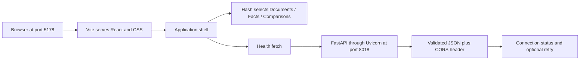

# User and data flow log

Updated after every completed phase. Current milestone: Part 1 complete (phases 1–5). Current local ports: frontend 5179, API 8019.

## Part 2 planning checkpoint

The next project slice will add persistent document flow rather than more shell UI. The operating plan is a staged progression:

- Phase 6: browser upload request → FastAPI endpoint → SQLite record creation.
- Phase 7: UI fetches stored documents and shows metadata and state change.
- Phase 8: uploaded PDFs are processed and extracted facts are stored with source references.
- Phase 9: comparison screens read the same stored facts and show evidence differences.

Each phase will update the learning logs and pause for review before the next implementation step.

## Phase 6 — SQLite document records and upload API

**User journey:** a browser or API client sends a file to POST /documents. The request includes file bytes and a MIME type. The FastAPI route reads the upload, stores it under backend/data/uploads, and creates a SQLite row with metadata for later use.

**Data flow:** browser upload or test client → FastAPI upload endpoint → file bytes written to disk → SQLite insert with filename, size_bytes, content_type, stored_path, created_at, and status → response includes the persisted record. A later GET /documents reads the database row(s) and returns them to the UI. No extraction or comparison logic is active yet; this phase is intentionally limited to reliably storing the source document itself.

**Storage:** the on-disk folder and SQLite database are local-only, which matches the practice-project goal. Document records are not yet connected to fact extraction, and no document list is rendered in the browser yet. The state is simple: uploaded file exists, metadata is recorded, and list retrieval works.

## Phase 7 — Document list and metadata screen

**User journey:** open the Documents view → the browser requests the saved document list → existing uploads appear as metadata rows. Select Upload PDF → choose a local file → the browser sends multipart data to POST /documents → the new record is inserted at the top of the list.

**Data flow:** React mounts the Documents view → fetches GET /documents from the configured API → stores the returned records in component state → renders count, filename, status, size, MIME type, and date. Upload state displays while POST /documents is in progress; success adds the API response to the list, and failure shows a local error message. Facts and Comparisons still use their planned empty states.

**Storage:** the browser does not store document bytes. It sends them to FastAPI, which writes the file and returns metadata. The browser only keeps the current list in memory and reloads it when the Documents view mounts.

## Phase 8 — PDF extraction and evidence-backed facts

**User journey:** upload a PDF → the backend stores the source file → pypdf reads each page → each non-empty extracted line becomes a fact linked to the uploaded document → the document reports `processed` or `extraction_failed`. A facts client can request all stored facts or filter them by document ID.

**Data flow:** multipart upload → document file on disk → `PdfReader` page text extraction → normalized non-empty lines → SQLite facts rows containing `document_id`, `claim`, `source_page`, and `source_text` → `GET /facts` response. The source text is retained alongside the claim so later UI work can show where each fact came from instead of presenting unsupported summaries.

**Storage:** facts are local SQLite records with a foreign-key relationship to documents. Extraction is intentionally deterministic and does not call an LLM; this keeps the evidence boundary inspectable while the data model is being proven. Frontend fact rendering and comparison behavior remain planned work.

## Phase 1 — Project foundation
User flow: no website runs yet; the developer opens the frontend and backend folders.
Data flow: reference PDFs remain local files. There is no browser request, server, database, or document processing yet.

## Phase 2 — React homepage
User flow: open localhost:5173 and see the Fact Layer introduction.
Data flow: browser requests index.html and frontend modules from Vite; React mounts App into the root element. All displayed text is static. No API call or persistent data exists.

## Phase 3 — Health API
User flow: the homepage still shows static content. A developer can separately open localhost:8000/health or /docs.
Data flow: HTTP GET /health → Uvicorn → FastAPI route → Pydantic response serialization → JSON response. React is not connected yet. No data is stored.

## Phase 4 — Browser/API connection
User flow: open the homepage → see “Checking connection…” → “Backend connected” if healthy. If unavailable, see an offline state and a Retry connection button.
Data flow: React effect → browser fetch to VITE_API_BASE_URL/health (default http://127.0.0.1:8000) → FastAPI → JSON and CORS header → runtime shape check → React state update → status label rerenders. Requests abort after five seconds or component cleanup. Retry starts a new request. Status is a point-in-time check, not continuous monitoring. Nothing is persisted.

## Phase 5 — Current complete user and data flow
**User journey:** open http://127.0.0.1:5178 → Documents screen → connection indicator checks the API. Navigate using sidebar links on desktop or top links on mobile, or select a summary card. Facts and Comparisons display their own headings and empty states. Browser Back and refresh retain the selected hash route. Upload is visibly disabled and upcoming. There are no documents to open or results to inspect yet.

**Page flow:** browser → Vite on 5178 → HTML, React modules and compiled CSS → React mounts the shell. The URL hash (#documents, #facts, #comparisons) selects local view state. Clicking a link updates the hash; a hashchange listener updates the visible section and title. No API request is needed to switch sections. The skip link targets the main content landmark. Unknown hashes fall back to Documents.

**API flow:** BackendStatus mounts → fetch http://127.0.0.1:8018/health → Uvicorn → FastAPI health handler → Pydantic JSON serialization → CORS permits localhost/127.0.0.1:5178 → browser validates the response shape → component updates its checking/connected/offline state. Failure or five-second timeout shows Retry connection. Navigation keeps the shell mounted, so it does not repeatedly request health. Reload or retry performs a new check. This remains a point-in-time health indicator.

**Storage:** section selection lives in the URL; connection status lives in browser memory. There is no database, upload request, PDF extraction, model call, or saved user data. The supplied datasets are not automatically imported. Summary cards use “—” to indicate unavailable counts, not measured zeros.

